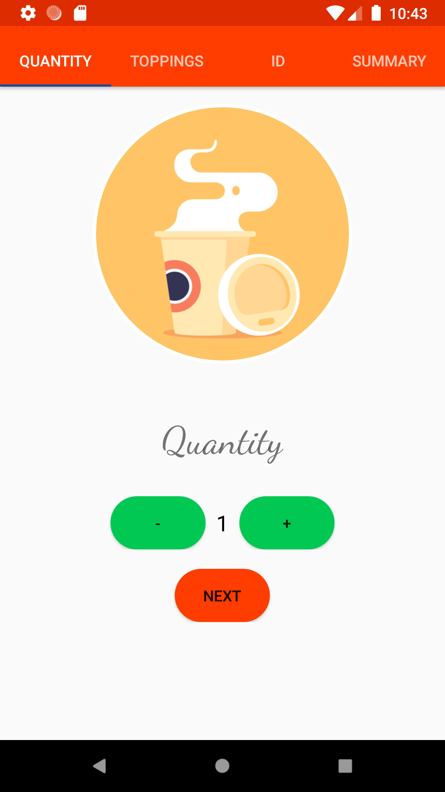
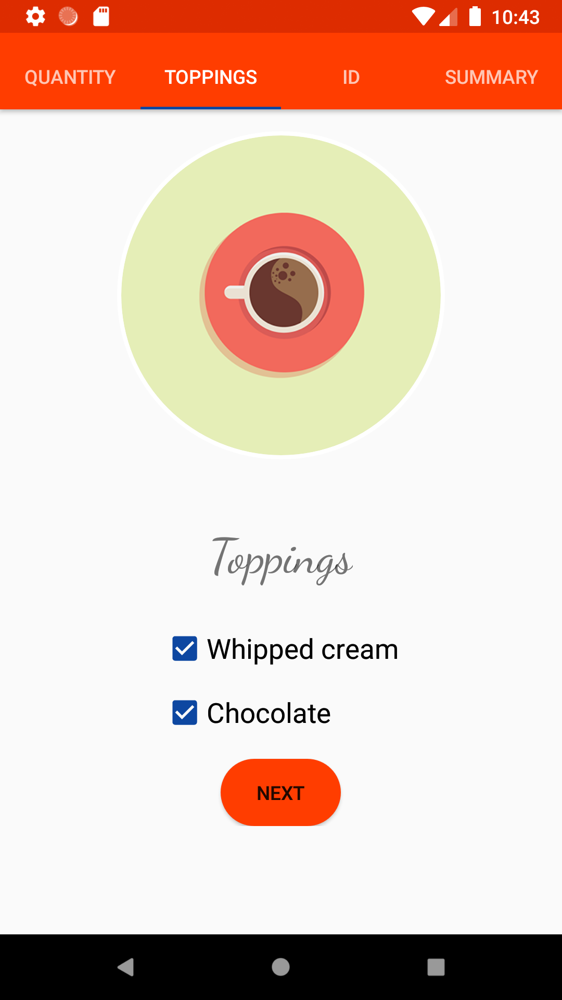
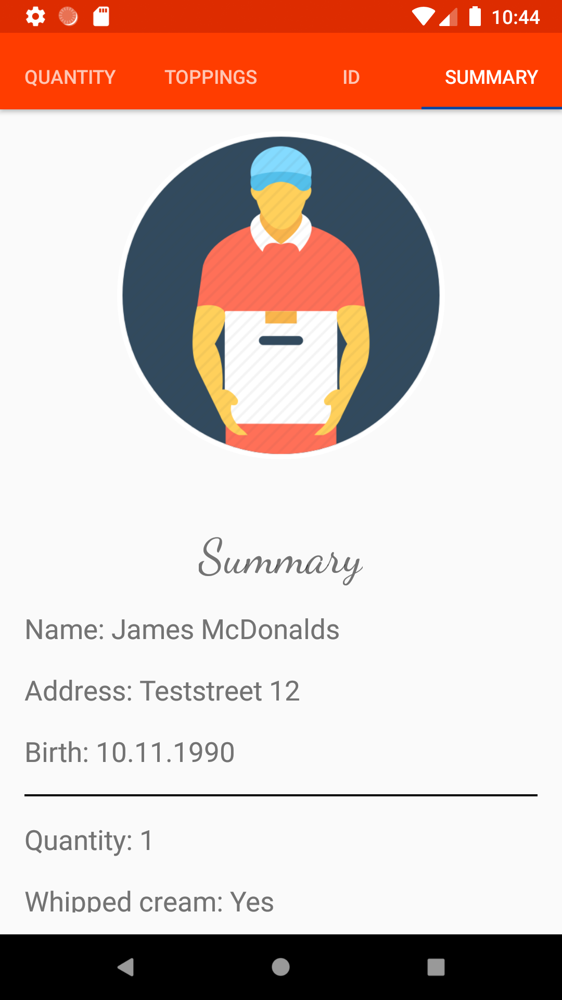
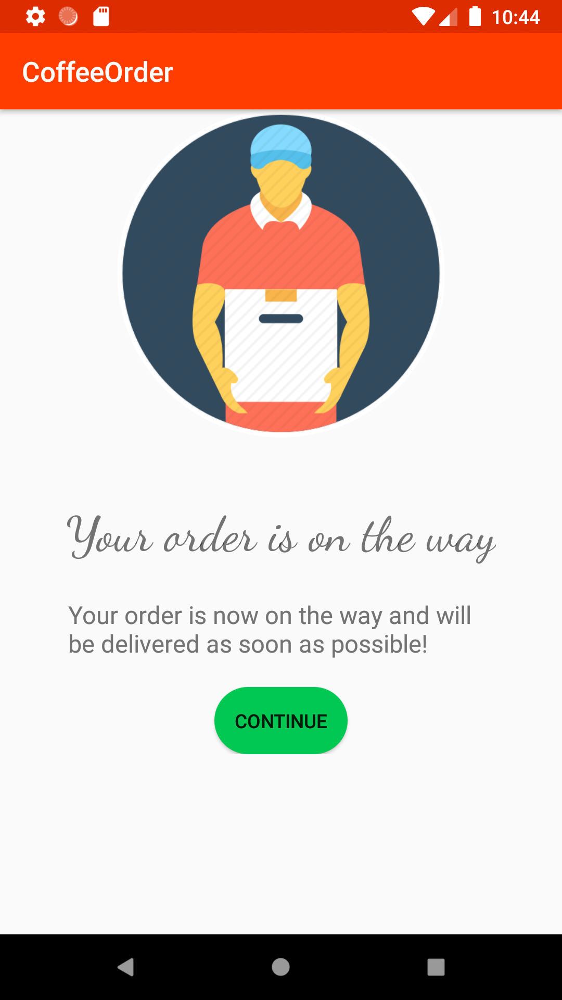

# coffeeorder
This is my updated version of the Udacity "Just Java" app.

Here are some screenshots of the app

First page: Quantity

Second page: Toppings

Thrid page: ID

Fourth page: Summary

Order completed page

