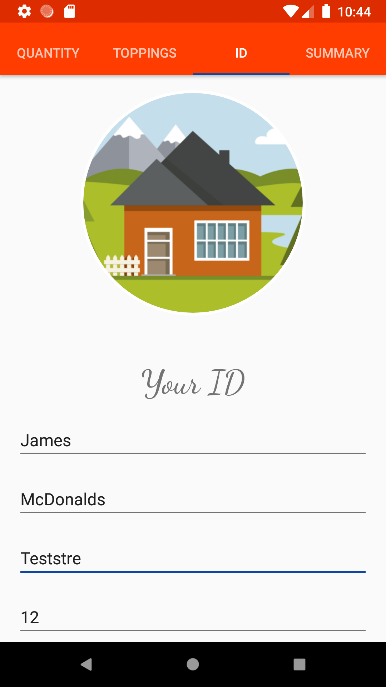

# coffeeorder
This is my updated version of the Udacity "Just Java" app.

Here are some screenshots of the app

First page: Quantity

Second page: Toppings

Thrid page: ID

Fourth page: Summary

Order completed page

### Feedback
I would be very pleased about an honest feedback.
You can give me feedback via my [Email](mailto:schaepersliam@gmail.com)
or you can open a new issue if you find a bug.

Thank you for your help gaining new experience!

### Using of the code
If you want to use the code not just for learning,
please contact me via my [Email](mailto:schaepersliam@gmail.com).

### Want to build Android apps too?
Check this [Udacity course](https://de.udacity.com/course/android-basics-user-input--ud836) out. :)

### You don't understand something in the code?
Feel free to contact me at any time via [Email](mailto:schaepersliam@gmail.com).

### Submit your changes
If you are interested in magnifying this project please make a new pull request.
I will definitively look after all of them! :)
